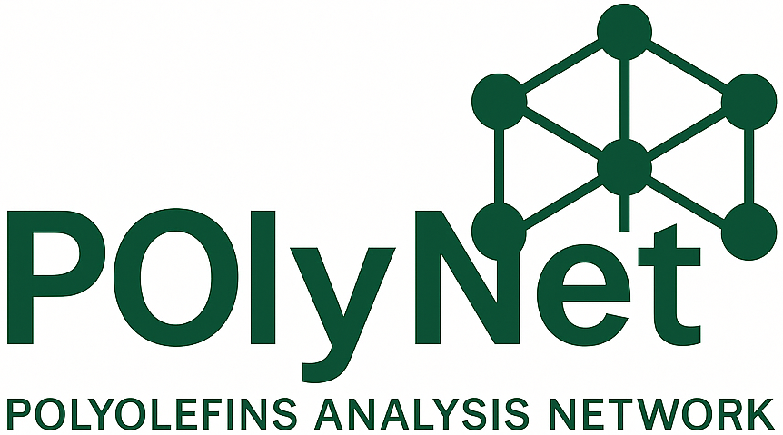

# POlyNet



POlyNet: Transformer-based deep learning framework for ultra-fast, automated, and interpretable analysis of polyolefin multimaterials from <sup>13</sup>C NMR spectra, enabling accurate identification, quantification, and characterization for polymer recycling applications.

## Overview
This repository provides an end‑to‑end workflow to:

1. **Generate** synthetic NMR spectra for polymer mixtures;
2. **Train** a multi‑task deep‑learning model that predicts both **weights** and **compositions** of the copolymers present;
3. **Fine‑tune** the model on experimental data;
4. **Evaluate** model performance and create insightful plots;

>N.B A statistical **Analysis** of the generated synthetic dataset can be performed through the `synthDataAnalysis.py` script.

The code is built on TensorFlow with **multi‑GPU** support and can run on local workstations or HPC clusters.

---

## Repository layout
```text
.
├── 0_synthDataGen.py        # Synthetic dataset generation
├── 1_trainModel.py          # Baseline model training on synthetic data
├── 2_fineTuneModel.py       # Fine‑tuning on pseudo-synthetic data
├── 3_testModel.py           # Evaluation and insight generation
├── synthDataAnalysis.py     # Statistical analysis of the synthetic set
├── utils/                   # Helper modules (losses, model blocks, etc.)
├── DATASET/                 # NMR libraries, synthetic data and test set
├── models/                  # Saved models
├── OUTPUT/                  # Plots and reports
└── environment.yml
```

---

## Prerequisites
This project ships with a fully‑pinned Conda environment file (environment.yml).  Key specs:
| Requirement | Version / Notes |
|------|----------|
Python | 3.12.6 (CPython) |
TensorFlow | 2.17.0 GPU build (CUDA 12.0) |
CUDA / cuDNN | CUDA 12 Toolkit, cuDNN ≥ 8.9 |
Core libs | tensorflow, numpy, pandas, scikit‑learn, matplotlib, seaborn, and other dependencies |

>⚠️ A recent NVIDIA GPU (Ampere or newer) is highly recommended—the code also runs on CPU but will be considerably slower.

## Create the environment

```bash
# clone repo
git clone https://github.com/MODAL-UNINA/POlyNet.git
cd POlyNet

# create & activate conda env
conda env create -f environment.yml
conda activate polynet-env
```

---

## Required datasets
| Path | Contents | URL |
|------|----------|-----|
| `DATASET/LIBS/lib_<COPOLYMER>.pkl` | NMR libraries of the individual copolymers (spectra, ppm domain, interpolation functions) | https://drive.google.com/file/d/1I2VRz_CGHrHKiBKb_Sl9bpZXhileTSjm/view?usp=sharing
| `DATASET/test_data.pkl` | Experimental dataset for evaluation/fine‑tuning | https://drive.google.com/file/d/1olKimZ1hDlfWmnsuqxluzPpty0giAFpt/view?usp=sharing
| `val_sets/<model_name>/` | Folder containing scaler and val-set files | https://drive.google.com/file/d/1F1TvMKcuPOlMIxBOndqkXyv-O8Kvn785/view?usp=sharing

> **NB:** NMR libraries will be provided via an external download link (see the project releases). After downloading, place the .pkl files in the indicated DATASET/LIBS/ directory.

---

## Quick‑start
```bash
# 1️⃣  Generate a synthetic dataset
python 0_synthDataGen.py   --n_samples 10000   --composition_points 30   --n_max_components 2   --proportion_weights 0.4,0.6   --dataset_name synthetic_dataset

# 2️⃣  Train the baseline model
python 1_trainModel.py   --batch_size 128   --gpus 0,1   --loss_weights kl_mse_loss   --loss_composition neg_mse   --dataset DATASET/synthetic_dataset.pkl   --test_dataset DATASET/test_data.pkl

# 3️⃣  Fine‑tune on experimental data
python 2_fineTuneModel.py   --gpus 0,1   --dataset-size 50000   --batch_size 64   --model model_weights_kl_mse_loss_composition_neg_mse_model_norm   --test_dataset DATASET/test_data.pkl

# 4️⃣  Evaluate and plot
python 3_testModel.py   --model_name model_weights_kl_mse_loss_composition_neg_mse_model_norm   --fine-tuned   --test_dataset DATASET/test_data.pkl

# 5️⃣  Analyse the synthetic set
python synthDataAnalysis.py
```

---

## Main scripts & key flags
### 0_synthDataGen.py
| Flag | Default | Description |
|------|---------|-------------|
| `--n_samples` | 10000 | Number of mixtures to generate |
| `--composition_points` | 30 | Composition points per copolymer |
| `--n_max_components` | 2 | Maximum number of components per mixture |
| `--proportion_weights` | "0.4,0.6" | Mixing weights |
| `--dataset_name` | synthetic_dataset | Output file name |

### 1_trainModel.py
| Flag | Default | Description |
|------|---------|-------------|
| `--batch_size` | 128 | Batch size *per GPU* |
| `--gpus` | "0,1,2,3,4,5" | GPUs to use |
| `--loss_weights` | kl_mse_loss | Loss for **weight** output |
| `--loss_composition` | neg_mse | Loss for **composition** output |
| `--dataset` | DATASET/synthetic_dataset.pkl | Training set |
| `--test_dataset` | DATASET/test_data.pkl | Initial test set |

### 2_fineTuneModel.py
| Flag | Default | Description |
|------|---------|-------------|
| `--gpus` | "0,1,2,3,4,5" | GPUs to use |
| `--dataset-size` | 50000 | Fine‑tuning samples |
| `--batch_size` | 64 | Batch size *per GPU* |
| `--model` | model_weights_kl_mse_loss_composition_neg_mse_model_norm | Initial model |
| `--test_dataset` | DATASET/test_data.pkl | Test dataset |

### 3_testModel.py
| Flag | Default | Description |
|------|---------|-------------|
| `--model_name` | model_weights_kl_mse_loss_composition_neg_mse_model_norm | Model run directory to evaluate |
| `--fine-tuned` | _(flag)_ | If set, loads **fine‑tuned** weights (`model_ft.weights.h5`) and history |
| `--test_dataset` | DATASET/test_data.pkl | Path to the *known* test set |
| `--test_dataset_unknown` | None | Optional path to a test set that includes **unknown** copolymers |

Advanced options such as the list of copolymers analysed (`copolymer_list`) or the number of validation samples (`n_val_samples`) can be tweaked inside the `opts` dictionary at the top of the script.

### synthDataAnalysis.py
Performs statistical analysis of the synthetic set and writes plots to `OUTPUT/synth_data_analysis/<dataset_name>/`.

---

## Expected outputs
| Path | Contents |
|------|----------|
| `DATASET/*.pkl` | Generated datasets |
| `models/<run_name>/` | Model weights (`*.weights.h5`) and JSON logs |
| `val_sets/<run_name>/` | Scalers and validation subset |
| `OUTPUT/eval_models/<run_name>/` | Performance plots |
| `OUTPUT/synth_data_analysis/` | Dataset statistics plots |

---

## Citation
This github contains the implementation of the pipeline presented in the paper (UNDER REVIEW) *Automated Ultra-Fast <sup>13</sup>C NMR Analysis of Polyolefin Multimaterials*

## Contact
For questions or suggestions open an *issue* or email <fabio.giampaolo@unina.it>.
